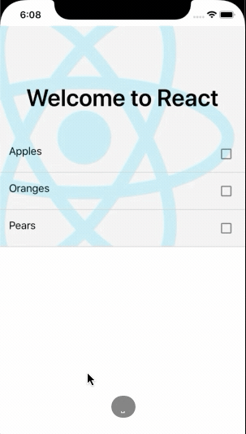

# react-native-checkbox-selection

> A customizables ListView that allows you to select multiple and single rows.

## Install

Using NPM

```sh
npm install react-native-checkbox-selection
```

Using Yarn

```sh
yarn add react-native-checkbox-selection
```

## Example
|Single Select at a time | Select With Title |  Select Without Title|
| :--------------------- | :--------------------------------------------: |  :------------------------------------------: | 
|| | |

## Usage

```js
import React, { Component } from "react";
import { View } from "react-native";
import MultiSelect from "react-native-checkbox-selection";

const fruits = ["Apples", "Oranges", "Pears"];
// --- OR ---
// const fruits = [
//   { label: 'Apples', value: 'appls' },
//   { label: 'Oranges', value: 'orngs' },
//   { label: 'Pears', value: 'pears' }
// ]

class App extends Component {
  state = { selectedFruits: [] };

  onSelectionsChange = (selectedFruits) => {
    // selectedFruits is array of { label, value }
    this.setState({ selectedFruits });
  };

  render() {
    return (
      <View>
        <MultiSelect
          data={fruits}
          onSelectedItemsChange={onSelectionsChange}
          selectedItems={this.state.selectedFruits}
          enableTitle
          title={"Select Fruits"}
        />
      </View>
    );
  }
}
export default App;
```

## Properties

| Prop                   |                    Default                     |   Type   | Description                                                                                                  |
| :--------------------- | :--------------------------------------------: | :------: | :----------------------------------------------------------------------------------------------------------- |
| data                  |                       `[]`                        | `array`  | All items available in the list (array of `string` or `{ label, value }`)                                    |
| selectedItems          |                      `[]`                      | `array`  | The currently selected items (array of `string` or `{ label, value }`)                                       |
| onSelectedItemsChange     |                       -                        |  `func`  | Callback called when a user selects or de-selects an item, passed `(selections)`                       |
| checkboxSource         |       [image](images/icon-checkbox.png)        | `object` | [Image source](https://facebook.github.io/react-native/docs/image.html#source) for the checkbox (unchecked). |
| selectedCheckboxSource |   [image](images/icon-checkbox-checked.png)    | `object` | [Image source](https://facebook.github.io/react-native/docs/image.html#source) for the checkbox (checked).   |                              |single | `false` | `bool` | Make an signle selection 
|disableAutoClose | `false` | `bool` | Disable Automatic Closing funcation 
|iconDisabled| `false` | `bool` | Disable caret icon
|enableTitle| `false` | `bool` | enable title for component
|icon| `caret-down` | `string` | change caret icon
|containerStyle    | `{}` | `object` | [Style](https://facebook.github.io/react-native/docs/text.html#style) for the container label.                
|styleTextDropdown    | `{}` | `object` | [Style](https://facebook.github.io/react-native/docs/text.html#style) for the dropdown text.                
## License

[ISC](LICENSE) © Suraj Sanwal
